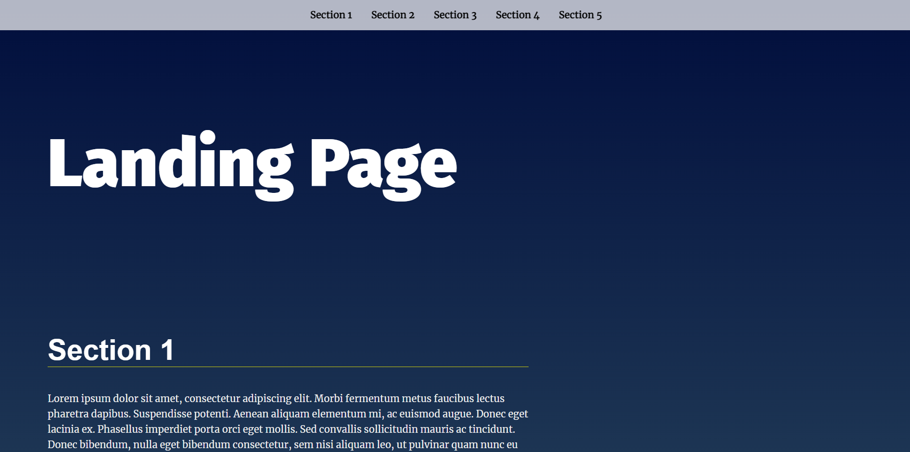

# Udacity-Landing-Page_Project

## Table of contents

*HTML & css cridits for Udacity.

*Java script code is written by me.

*Dynamically updating navigational menu based on the amount of content that is added to the page.

*Scroll to the top button.

*Highlight active class by add and remove active class when scrolling through the sections.

## Helping Resourses

*[youtube](https://www.youtube.com/watch?v=_tyL1tNrI5k&ab_channel=LazyBrogrammer)

*[GitHub](https://github.com/T7Q/Landing-page)
